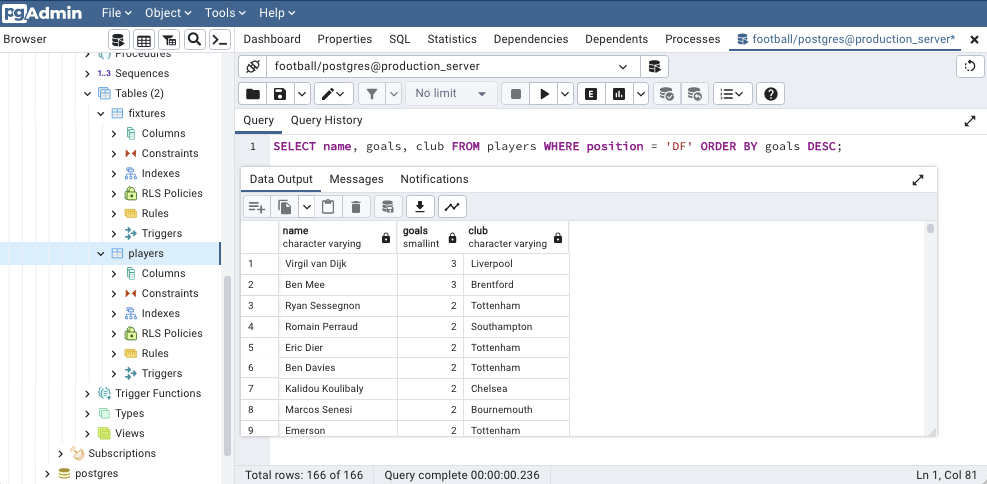
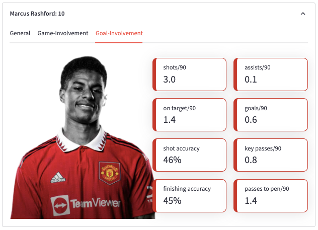
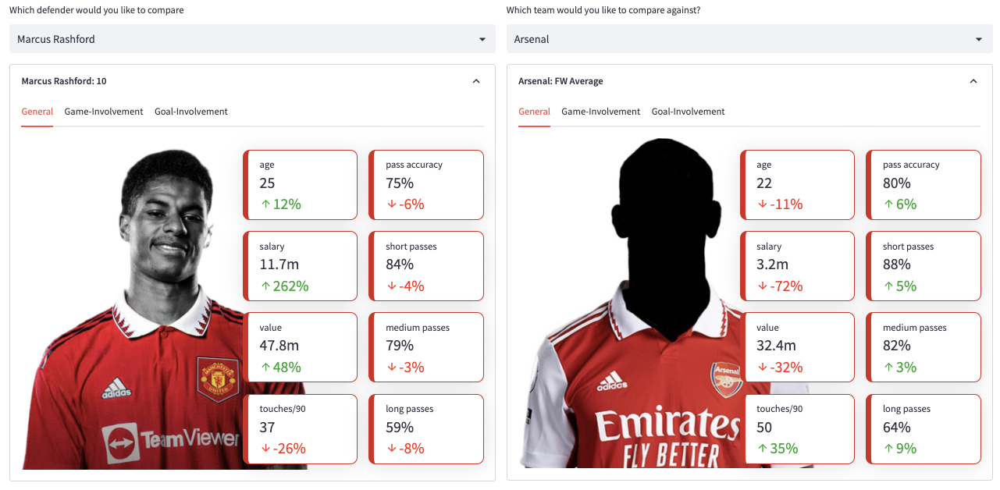
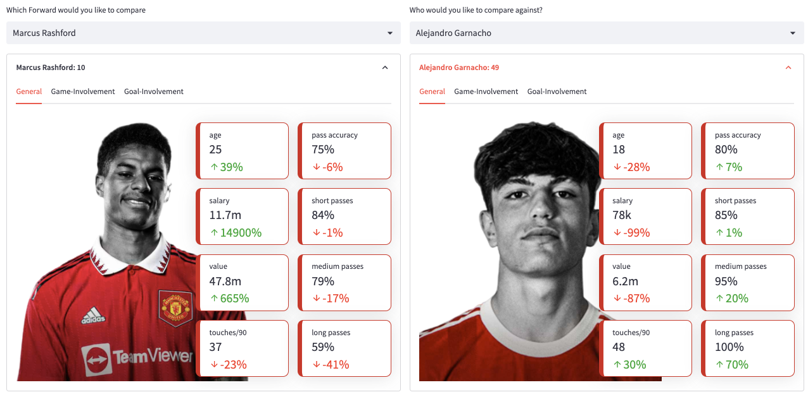
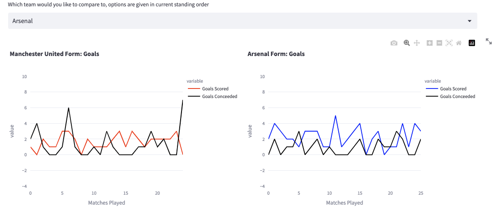
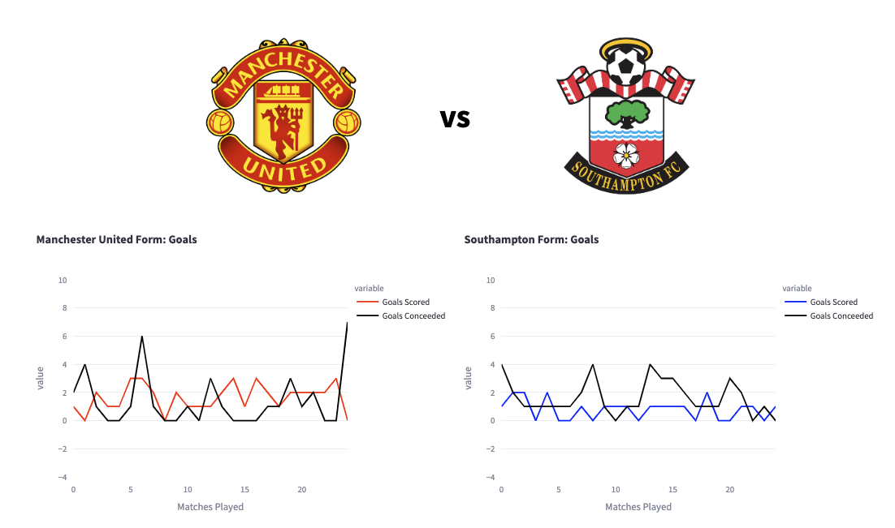

<h1 align="center">Manchester United in the Premier League</h1>

**Technologies Used**: Python, Git, AWS S3, AWS RDS,  PostgreSQL, Psycopg2, Pandas, Streamlit & Plotly
<div align="center">
	
	 
	
	
     
    
    
     
  </div>
          
<br>

***Disclaimer**: I use Streamlit Community Cloud (free) to host this project, as this is a free hosting service, the speed can be slightly slow, but streamlit was used to greatly simplify the front-end coding without sacrificing on aesthetics and allow me to focus on the back-end*

## Introduction 

This project aims to provide insights into the English Premier League as a whole, including player performance and league statistics, as well as diving deeper into the data to analyze the performance of my favourite team, Manchester United, throughout the season

I used Python for scraping the data, data manipulation and the Streamlit front-end framework with Pandas & Plotly to create a web-application to interactively visualise the data

I store the data in an AWS PostgreSQL RDS and store a copy of the data in an AWS S3 bucket. Storing in the cloud allows me to have flexiblity to expand the database as there is an abundance of premier league data I can leverage in the future. Psycopg2 is used as a PostgreSQL adapter for Python

The project is split up into five main sections;

- Scraping the data 
- Storing the data
- Connecting to the data
- Computing statistics
- Visualising the data

### 1) Scraping

The link to all the club datasource links can be found [here](https://github.com/gabriella-martin/Manchester-United/blob/main/club_data_links.csv), the code for grabbing the html can be found [here](https://github.com/gabriella-martin/Manchester-United/blob/main/HTMLGrabber.py) and the code for parsing the HTML to retrieve the data and cleaning/processing the data can be found [here](https://github.com/gabriella-martin/Manchester-United/blob/main/Pipelines/BatchData_Pipeline.py)

**Individual Player Data**

I first began by deciding what data I wanted to scrape. I wanted player specific data for each player in the EPL this season. For each team in the EPL, comprehensive player stats can be found at [Football Reference](https://fbref.com/en/squads/19538871/Manchester-United-Stats). There is a wealth of stats from this site but I chose about 50 statistics to scrape.

I also wanted to take financial related data to each player like their salary and estimated market value, which I scraped from [here](https://salarysport.com/football/premier-league/manchester-united-f.c./) and [here](https://www.footballtransfers.com/en/teams/uk/man-utd) respectively. Next to get each players shirt number I used the official premier league [website](https://www.premierleague.com/clubs/12/Manchester-United/squad).

To scrape the HTML data I used [requests](https://pypi.org/project/requests/) and to parse the HTML I used [BeautifulSoup](https://pypi.org/project/beautifulsoup4/). Each club had its own dataframe of player data which I collated into one master CSV 

**Fixture Data**

I knew I wanted to get some simple fixture specific data like teams playing, goals for & goals against, [fbref](https://fbref.com/en/comps/9/schedule/Premier-League-Scores-and-Fixtures) have a single table of all premier league fixtures, past and upcoming and their results which they allow easy download of.

**Standings Data**

Rather than creating another scraper to get the table data, with all of this season's fixture data I had all the data I needed to code the logic behind the table and could instead write some Python to get up to date standings.


### 2) Storing

With my two databases, player data and fixture data, I first backed up the databases in a AWS S3 bucket using this [script](https://github.com/gabriella-martin/Manchester-United/blob/main/Pipelines/AWS_Pipeline.py). I then stored the database on a AWS PostgreSQL RDS. 

Using SQL I then began to explore my data by writing queries, here is an example of finding the top goalscoring defenders in the premier league



### 2) Connecting

So with the database all set up, I connected the database to my python script using [psycopg2](https://pypi.org/project/psycopg2/), the following code sets up the connection and executes a simple query:

```python

import psycopg2

DATABASE_TYPE = 'postgresql'
DBAPI = 'psycopg2'
ENDPOINT = 'database-1.c0lrvxe9frij.eu-west-2.rds.amazonaws.com'
USER = 'postgres'
PASSWORD = st.secrets['DATABASE_PASSWORD'] 
PORT = 5432
DATABASE = 'football'

with psycopg2.connect(host=ENDPOINT, user=USER, password=PASSWORD, dbname=DATABASE, 
port=PORT) as conn:
    with conn.cursor() as cur:
        cur.execute('''SELECT name FROM players WHERE club = 'Manchester United' LIMIT 5;''')
        results = cur.fetchall()
        cur.close()
```


### 3) Computing 

**Player Data**:

*The database for this particular section can be found [here](https://github.com/gabriella-martin/Manchester-United/blob/main/Players.csv)*

I decided what attributes would be insightful for each position and came to the following categories:

- **Goalkeepers**: General & Saving

- **Defenders:** General, Threat-Handling & Defender Upfield Stats
  
- **Midfielders:** General, Threat-Handling & Midfielder Upfield Stats

- **Forwards:** General, Game Involvement & Goal Involvement

In order for a player to be showcased by my web-application I set the requirement that they must have played over 90 minutes in total (this does not have to be consecutive) as this was the best way to ensure that the per 90 stats would be an accurate measure. For example if a player has only played for 10 minutes in total this season but managed to score a goal in this time, their goals per 90 would be 9 goals; a clearly innacurate measure. Adjusting the raw data to be per 90 minutes intuitivtely just allows for us to make meaningful comparisons between players.

With these categories of data in mind, I coded a data pipeline that would connect to my AWS PostgreSQL RDS and query each metric with SQL. The full code for retrieving and formatting these statistics can be found [here](https://github.com/gabriella-martin/Manchester-United/blob/main/Pipelines/ServingData_Pipeline.py). Each category of data has its own retrieving method and sometimes a formatting method, here is an example of the methods for the category 'threat handling'. The use of try/except is to handle any NULL datapoints or any situations where python would attempt to divide by 0. 

```python
    def get_threat_handling_stats(self):
        threat_stats = ['shot_blocks', 'blocks', 'interceptions', 'clearances', 
        'total_tackles', 'successful_tackles','sucessful_takeons', 'fouls_committed' ]
        player_threat_stats = []
        with self.conn.cursor() as cur:
            for i in threat_stats:
                q = f"""SELECT {i}
                    FROM players WHERE name = '{self.player}'
                    ;"""
                cur.execute(q)
                records = cur.fetchall()    
                for i in records:
                    i = i[0]
                    i = float(i)
                    player_threat_stats.append(i)
            cur.close()         

        return player_threat_stats

    def format_threat_stats(self):
        player_threat_stats = self.get_threat_handling_stats()
        try:
            tackle_success = round((player_threat_stats[5]/player_threat_stats[4])*100)
        except ZeroDivisionError:
            tackle_success = 'NA'
        for index, value in enumerate(player_threat_stats):
            try:    
                # change successful tackle count to a % of tackles successful
                if index == 5:
                    player_threat_stats[index] = tackle_success
                    
                elif index in range(0,5) or index == 7:
                    player_threat_stats[index] = round(value/self.ninetys,1)
       
            except TypeError:
                pass

        return player_threat_stats

```
**Average Player Data**

To compare United against the average of a particular club player of the same position, I coded a very similar class to the player stats but instead of the queries looking like:
```python
q = f"""SELECT {value} FROM players WHERE name = '{self.player}';"""
```
they instead looked like:
```python
q = f"""SELECT AVG({value})FROM players WHERE club = '{self.club}' and position = '{self.position}';"""
```
The full code for calculating club position specific averages can be viewed [here](https://github.com/gabriella-martin/Manchester-United/blob/main/Pipelines/AveragePlayer_Pipeline.py)

**Club General Data**

Grabbing the fixture results data allowed me to use python to code the logic behind the EPL league table - win is 3 points, draw is 1 etc. I created a class that would get detailed fixture data for any club. This class would return a dataframe with data from each fixture, here is a snippet of the code:
```python
    def create_club_dataframe(self):
        matches_played, point_list, goals_scored, goals_conceeded, opponents, net_goals = self.get_matches_played()
        df = pd.DataFrame({'Matches Played': matches_played ,'Points':point_list, 'Goals Scored': goals_scored, 
        'Goals Conceeded': goals_conceeded, 'Net Goals': net_goals, 'Opponents':opponents})

        df['Points Sum'] = df['Points'].cumsum()
        df['Points Rolling Average'] =df['Points'].expanding(1).mean()
        df['Goals Scored CMA'] =df['Goals Scored'].expanding(1).mean()
        df['Goals Conceeded CMA'] =df['Goals Conceeded'].expanding(1).mean()
        df['Net Goals CMA'] =df['Net Goals'].expanding(1).mean()
        return df
```
Intuitively, by looking at the 'Points Sum' column for each of the club dataframes, we can easily order the clubs by points to get the current table standings. The full code for these club-wide stats can be viewed [here](https://github.com/gabriella-martin/Manchester-United/blob/main/Pipelines/GeneralStats_Pipeline.py)

### 4) Visualising

**Position Pages**

With a pipeline of statistic retrival established, then came coding a visually appealing player card, this was coded using the Streamlit framework. Here is an example for what a forward stat card looks like, the full code for these stat cards can be viewed [here](https://github.com/gabriella-martin/Manchester-United/blob/main/Stat_Cards.py):

<center>  </center>

As this project is focused on Manchester United, I downloaded all the player images from their website,for the rest of the premier league teams, a blacked out version is used. For each player in each position a stat card is generated and showcased in the index section.

I wanted to add more functionality to the data visualisation and coded a percentage change comparison so that for each player you could compare against:

- The other United players with that position
- Average of the United players with that position
- Average of the each club of the Premier League table position average

Here is an example of how comparisons look:

<center>  </center>

<center>  </center>


**General Page**

This page enables comparison at the club level and uses the statistics retrived from the general stats script. The user chooses a team to compare against (teams are given in current standing order) and can view graphical visualisations of core statistics like goals conceeded, goals scored, net goals, points per game and cumulative points

Here is an example of one of these graphical comparisons:

<center>  </center>

**Upcoming Page**

The code for this page is similar to the general page, but here I query the fixtures database to get the next EPL match united face and serve the corresponding stats to enable comparison between United and their next rival

<center>  </center>